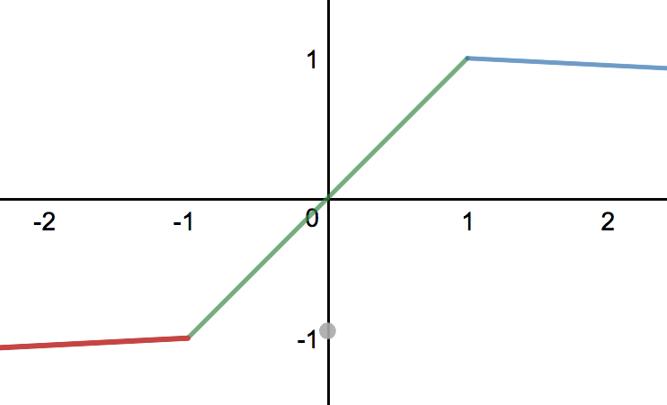
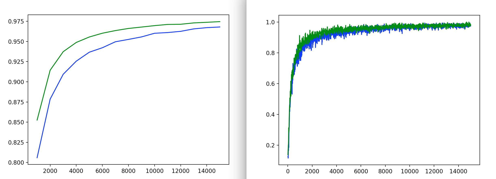

In this directory, I investigated the effects of using a new nonlinearity with
the potential to speed up neural network training process.  As the nonlinearity
is essentially RELU with an upper bound, I call it **"Upper ReLU"**.

What is Upper ReLU?
-----------------------
Upper ReLU is a nonlinearity that tries to squeeze values between -1 and 1.

The basic form of Upper ReLU is simple and exactly matches the standard nonlinearity
for [Cellular Neural Networks](http://www.scholarpedia.org/article/Cellular_neural_network).

```
(∞, -1): y = -1 + ⍺(x+1)
[-1, 1]: y = x
(1, ∞):	 y = 1 - ⍺(x-1)
```

However, András and I decided to make Upper ReLU "leaky" to ensure values don't get 
stuck at the endpoints of -1 and 1.  This regime forces values back into the [-1,1] 
range.



```
(∞, -1): y = -1 + ⍺(x+1)
[-1, 1]: y = x
(1, ∞):	 y = 1 - ⍺(x-1)
```
This can easily be implemented in TensorFlow as follows:
```python
alpha = .01
ReLU = tf.maximum(-1+alpha*(Input+1), Input)
ReLU = tf.minimum(1-alpha*(ReLU-1), ReLU)
```


How did I find this nonlinearity?
-------------------------------------
When working on removing the fully-connected layer (FCL) from our convolutional 
neural networks (CNNs), I noticed an interesting problem with our approach.  Lets 
say we are working with ten classes.  Essentially, instead of a FCL, we compare our 
ten output maps (one for each of the ten classes) from the last convolutional layer 
to ten target maps, 9 of all -1s and 1 filled with 1s in the position corresponding 
to the correct label. See [here](../cnn_no_fcl) for more information on our 
approach. I "discovered" the upper ReLU nonlinearity when trying to speed up the slow
convergence time associated with this approach. Since ReLU is only bounded on one 
end, the distances to the 1 maps were consistently greater than the distances to the 
-1 maps until the network was trained enough to standardize the differences.  
Until these differences were standardized, the network would perform terribly.  

Once you understand this issue, it is somewhat obvious why Upper ReLU would result
in a significant training speedup.  However, it is not as clear that it would work
similarly in other network architectures.  András decided to test Upper ReLU on a 
simple CNN with a FCL as well as [AlexNet](http://vision.stanford.edu/teaching/cs231b_spring1415/slides/alexnet_tugce_kyunghee.pdf) and noticed a similar speedup, so we 
then decided to delve into an in-depth study of the nonlinearity.

Initial Findings
----------------
After I figured out its potential, I ran some quick initial tests on Upper ReLU.
Those results are stored in the [InitialFindings](./InitialFindings) folder. 

What We Tested:
--------------
We were confident that Upper ReLU speeds up training time compared to normal or
leaky ReLU, but before going forward too far, we did a literature search to find
other approaches researchers have successfully used to speed up training time.
The most relevant methods we found were 
[batch normalization](https://arxiv.org/abs/1502.03167) and the exponential linear
unit ([ELU](http://image-net.org/challenges/posters/JKU_EN_RGB_Schwarz_poster.pdf)).
Prenormalizing the input data by squeezing it all into the ReLU scheme ([0,1] for 
normal ReLU and [-1,1] for Upper ReLU) before the network starts learning can also
help. I ran tests on both MNIST and CIFAR-10 for networks with and without 
batch-normalization, pre-normalization, Upper ReLU, ELU, and some combinations 
thereof, storing the results as numpy data files in the [results](./results) folder.

Some Interesting Results:
-------------------------
In all of the following graphs, the network with Upper ReLU is represented in green.
Training accuracy results are displayed on the right, while independent test
accuracies are shown on the left.

##### ReLU vs. Upper ReLU



Using the Graphing File:
------------------------
